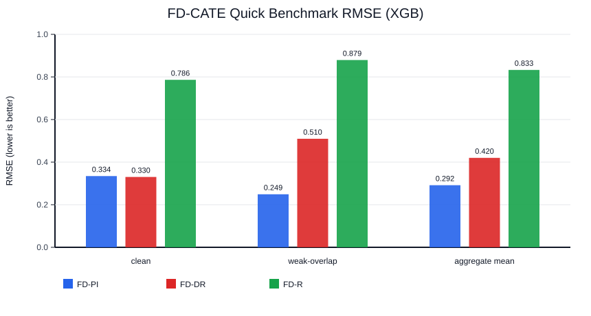

# FD-CATE

Front-door CATE/ATE estimation toolkit with paper-parity defaults for debiased front-door learners.

This repository keeps the original research scripts (`FDCATE.py`, `analyze_fars_2000_fd.py`) and adds a standard-library interface (`fd_cate`) with a stable artifact contract.

## Install

```bash
python -m pip install -U pip
python -m pip install .
```

Default learner is `xgb` (XGBoost). `nn` is also supported via `nuisance_learner="nn"`.

## Quickstart (Python API)

```python
from fd_cate import FDCATE
from FDCATE import simulate_fd_data_md

# synthetic example
D = simulate_fd_data_md(n=500, d=10, seed=0)

est = FDCATE(method="fd-dr", nuisance_learner="xgb", random_state=0)
est.fit(D.C, D.Y, t=D.X, m=D.Z)

tau = est.effect(D.C)
print(est.ate_)
print(est.summary())
```

## Quickstart (CLI)

```bash
# generate synthetic csv
fdcate synthetic --n 300 --d 8 --seed 42 --out synthetic.csv

# fit + write standard artifacts
fdcate fit \
  --data synthetic.csv \
  --outcome y --treat t --med m \
  --outdir out/

# diagnostics only
fdcate doctor \
  --data synthetic.csv \
  --outcome y --treat t --med m
```

Standard artifacts under `out/`:
- `summary.txt`
- `results.json`
- `diagnostics.json`
- `effects.csv`
- `model.pkl`

## Benchmark (Quick Profile + Golden Regression)

`fd-cate` now includes a deterministic quick benchmark profile for regression checks.

```bash
fdcate benchmark --n 120 --d 6 --seed 2026 --nuisance-learner xgb --out results/benchmark_quick.json
```

Multi-seed profile (recommended for robust comparisons):

```bash
fdcate benchmark \
  --profile multiseed \
  --n 120 --d 6 --seed 2026 --n-seeds 20 \
  --nuisance-learner xgb \
  --fd-r-g-solver direct \
  --fd-r-b-learner xgb \
  --out results/benchmark_multiseed.json
```

Output schema (`fdcate.benchmark`, `schema_version=0`) contains:
- `clean` RMSE for `fd-pi`, `fd-dr`, `fd-r`
- `weak-overlap` RMSE for `fd-pi`, `fd-dr`, `fd-r`
- `aggregate_mean_rmse` across the two scenarios
- with `--profile multiseed`: `per_seed` results + summary statistics (`mean/std/min/max`)

FD-R benchmarking knobs:
- `--fd-r-g-solver`: `direct` or `ratio`
- `--fd-r-b-learner`: `xgb` or `nn`
- `--no-fd-r-swap-average`: disable swapped D1/D2 averaging

CI also runs a golden snapshot regression test:
- `tests/test_benchmark_golden.py`
- golden reference file: `tests/benchmark_quick_reference.json`

## Live Demo (Toy + Benchmark)

Run the end-to-end live demo (synthetic fit/effect + benchmark):

```bash
bash scripts/run_demo_quick.sh
```

The demo writes:
- `/tmp/fdcate_live_demo/fit_out/summary.txt`
- `/tmp/fdcate_live_demo/fit_out/results.json`
- `/tmp/fdcate_live_demo/fit_out/diagnostics.json`
- `/tmp/fdcate_live_demo/fit_out/effects.csv`
- `/tmp/fdcate_live_demo/fit_out/model.pkl`
- `/tmp/fdcate_live_demo/benchmark_quick.json`

Manual one-liners:

```bash
fdcate synthetic --n 120 --d 6 --seed 2026 --out /tmp/fdcate_live_demo/synthetic.csv
fdcate fit --data /tmp/fdcate_live_demo/synthetic.csv --outcome y --treat t --med m --method fd-dr --nuisance-learner xgb --outdir /tmp/fdcate_live_demo/fit_out
fdcate benchmark --n 60 --d 4 --seed 17 --nuisance-learner xgb --out /tmp/fdcate_live_demo/benchmark_quick.json
```

Example terminal output preview:

```text
[demo] output directory: /tmp/fdcate_live_demo
[demo] 1) synthetic data
Saved synthetic dataset to: /tmp/fdcate_live_demo/synthetic.csv
[demo] 2) fit model + artifact contract
ATE=0.540874
Saved artifacts to: /tmp/fdcate_live_demo/fit_out
[demo] 3) effects from saved model
Saved effects to: /tmp/fdcate_live_demo/effects_from_model.csv
[demo] 4) quick benchmark
Saved benchmark report to: /tmp/fdcate_live_demo/benchmark_quick.json
```

## Experiment Results Snapshot (Quick Benchmark, XGB)

Configuration:
- `n=60`, `d=4`, `seed=17`, `learner=xgb`
- scenarios: `clean`, `weak-overlap`

RMSE snapshot:

| Scenario | FD-PI | FD-DR | FD-R |
|---|---:|---:|---:|
| clean | 0.3344 | 0.3302 | 0.7864 |
| weak-overlap | 0.2490 | 0.5096 | 0.8794 |
| aggregate mean | 0.2917 | 0.4199 | 0.8329 |

Reference source:
- `tests/benchmark_quick_reference.json`

Quick benchmark RMSE plot:



Final benchmark figures (FD-R full-noise setting):


## Model Compatibility Policy (`model.pkl`)

`model.pkl` loading is allowed only when **major.minor** package versions match.

- Example: model saved with `0.1.x` can be loaded by `0.1.y`.
- Example: model saved with `0.1.x` cannot be loaded by `0.2.x`.

## Scope (v0.1)

Supported:
- binary treatment `T ∈ {0,1}`
- binary mediator `M ∈ {0,1}`
- numeric covariates
- continuous or binary outcome (regression handling)

Not supported:
- non-binary `T`/`M`
- automatic categorical encoding pipelines

## Legacy Reproduction Scripts

The original paper-focused scripts are preserved:
- `python FDCATE.py --help`
- `python analyze_fars_2000_fd.py --help`

## Development

```bash
python -m pip install -e .[dev]
python -m pytest -q
python -m build
```
