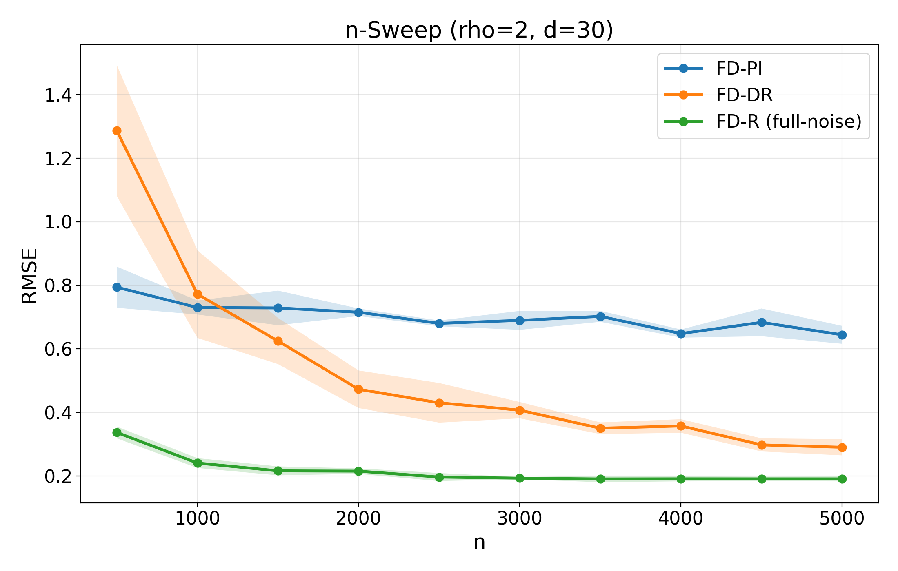
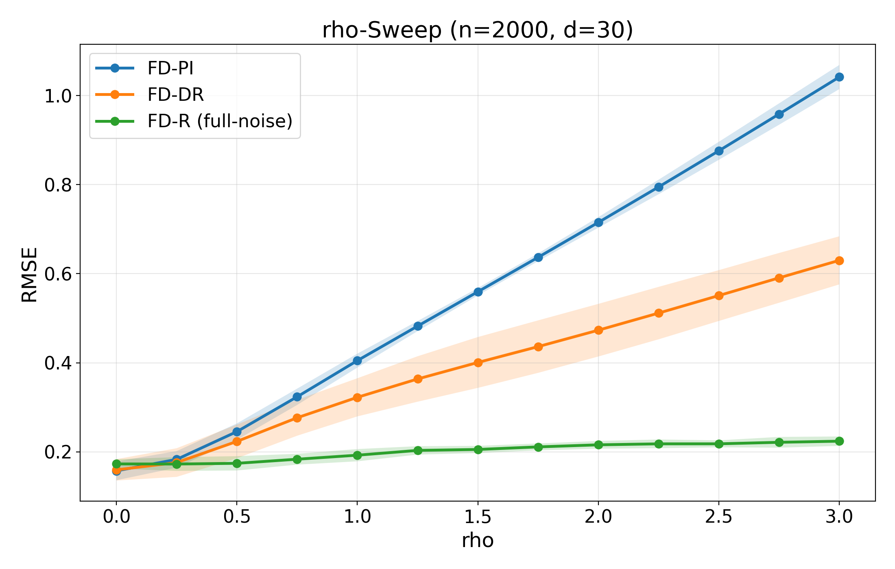

# FD-CATE: Personalized Causal Inference Under Unmeasured Confounding

[Paper](https://arxiv.org/abs/2509.22531) | [GitHub](https://github.com/yonghanjung/FD-CATE) | [HF Demo](https://huggingface.co/spaces/yonghanjung/fdcate-demo) | [PyPI](https://pypi.org/project/fd-cate/) | [Citation](CITATION.cff) | [Quickstart](#one-command-quickstart) | [Reproduce paper](#reproduce-paper)

Estimate heterogeneous treatment effects even when treatment and outcome share hidden confounders, by leveraging front-door identification through an observed mediator.

Front-door identification uses an observed mediator on the path from cause to outcome to recover causal effects when hidden confounding makes ordinary adjustment unreliable. This paper extends that idea to personalized causal inference, introducing FD-DR and FD-R for heterogeneous effects.





## Why it matters
- Hidden confounding usually breaks individualized causal inference.
- Front-door structure can restore identification when an observed mediator is available.
- FD-DR and FD-R remain more accurate than FD-PI even when nuisance noise and hidden-variable effects are strong.

### Who is this for?
- Researchers studying heterogeneous treatment effects beyond standard back-door assumptions.
- Practitioners with an observed mediator but no credible no-unmeasured-confounding story.
- Readers who want a runnable method showcase, not only a paper supplement.

## One-command quickstart
```bash
python -m pip install fd-cate
fdcate demo --outdir ./fdcate-demo
```

Outputs:
- `synthetic.csv`
- `results.json`
- `diagnostics.json`
- `effects.csv`

## What you get
- Debiased front-door learners: `FD-DR` and `FD-R`
- Plug-in baseline: `FD-PI`
- One-command demo plus CLI and Python API
- Synthetic robustness benchmarks and a FARS case study
- Reproducible artifacts for effects, diagnostics, and benchmark summaries

## Main figure
The synthetic benchmarks visualize the core message of the paper: when hidden-variable influence and nuisance noise get stronger, the debiased learners stay substantially more accurate than the plug-in estimator. That is the point of this repository: not just that front-door identification is possible, but that personalized front-door estimation can be made robust and runnable.

## Reproduce paper
Paper: [Debiased Front-Door Learners for Heterogeneous Effects](https://arxiv.org/abs/2509.22531)

Run the installable demo:

```bash
fdcate demo --outdir /tmp/fdcate-demo
```

Run the benchmark profile used for regression and smoke validation:

```bash
fdcate benchmark --profile multiseed --n 120 --d 6 --seed 2026 --n-seeds 20 --nuisance-learner xgb --out /tmp/fdcate-benchmark.json
```

Run the original paper-oriented scripts:

```bash
python FDCATE.py --help
python analyze_fars_2000_fd.py --help
```

The repository preserves both paths:
- `fdcate ...` for package-style usage
- `FDCATE.py` and `analyze_fars_2000_fd.py` for legacy paper reproduction

## Citation
Software citation metadata is in [CITATION.cff](CITATION.cff).

```bibtex
@article{jung2025fdcate,
  title   = {Debiased Front-Door Learners for Heterogeneous Effects},
  author  = {Jung, Yonghan},
  year    = {2025},
  url     = {https://arxiv.org/abs/2509.22531}
}
```

## Links
- Paper: <https://arxiv.org/abs/2509.22531>
- PyPI: <https://pypi.org/project/fd-cate/>
- Repository: <https://github.com/yonghanjung/FD-CATE>
- Hugging Face demo: <https://huggingface.co/spaces/yonghanjung/fdcate-demo>
- Release checklist: [RELEASE_RUNBOOK.md](RELEASE_RUNBOOK.md)

## Python API
```python
from fd_cate import FDCATE
from FDCATE import simulate_fd_data_md

data = simulate_fd_data_md(n=500, d=10, seed=0)
est = FDCATE(method="fd-dr", nuisance_learner="xgb", random_state=0)
est.fit(data.C, data.Y, t=data.X, m=data.Z)

tau = est.effect(data.C)
print(est.ate_)
print(est.summary())
```

## CLI reference
```bash
# Generate a synthetic CSV
fdcate synthetic --n 300 --d 8 --seed 42 --out synthetic.csv

# Fit and write standard artifacts
fdcate fit --data synthetic.csv --outcome y --treat t --med m --outdir out/

# Run diagnostics only
fdcate doctor --data synthetic.csv --outcome y --treat t --med m
```

Standard artifacts under `out/`:
- `summary.txt`
- `results.json`
- `diagnostics.json`
- `effects.csv`
- `model.pkl`

## Live demo
Primary path:

```bash
fdcate demo --outdir /tmp/fdcate_live_demo
```

Legacy helper script:

```bash
bash scripts/run_demo_quick.sh
```

Expected demo artifacts:
- `/tmp/fdcate_live_demo/synthetic.csv`
- `/tmp/fdcate_live_demo/fit_out/summary.txt`
- `/tmp/fdcate_live_demo/fit_out/results.json`
- `/tmp/fdcate_live_demo/fit_out/diagnostics.json`
- `/tmp/fdcate_live_demo/fit_out/effects.csv`
- `/tmp/fdcate_live_demo/fit_out/model.pkl`
- `/tmp/fdcate_live_demo/benchmark_quick.json`

## Scope
Supported:
- binary treatment `T in {0,1}`
- binary mediator `M in {0,1}`
- numeric covariates
- continuous or binary outcome

Not supported:
- non-binary `T` or `M`
- automatic categorical encoding pipelines

## Development
```bash
python -m pip install -e .[dev]
python -m pytest -q
python -m build
```

Slow tests:

```bash
python -m pytest -q -m "slow"
```

## Troubleshooting
1. If `fdcate` is not found, reopen the shell or use `python -m fd_cate --help`.
2. If XGBoost has import issues, reinstall in a clean environment with `python -m pip install --force-reinstall fd-cate`.
3. If writes fail, point `--outdir` to a writable location such as `/tmp/fdcate-demo`.
